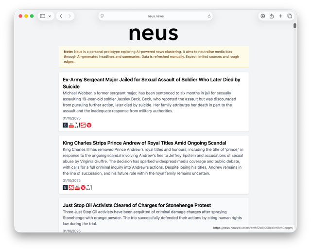
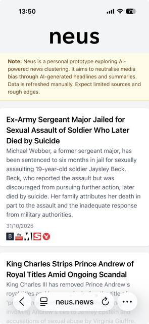

# Neus

**Live at [neus.news](https://neus.news)**

An AI-powered news aggregation platform that cuts through media bias by presenting neutral, clustered news stories.

[](https://neus.news)

## What is Neus?

Neus is a personal prototype exploring AI-powered news clustering. It aims to reduce polarisation and combat misinformation by rethinking how news is presented, summarised, and sourced.

Instead of sensationalized headlines and algorithmic rage-feeds, Neus groups related articles from different publications into single story cards, each featuring:

- **AI-generated neutral headlines and summaries** - abstracting away ideological slants
- **Source icons linking to original articles** - maintaining transparency and attribution
- **Semantic clustering** - grouping coverage of the same story across the political spectrum

## How It Works

1. **Ingestion**: RSS feeds from multiple UK news sources are crawled regularly
2. **Embedding**: Article content is converted to vector embeddings using OpenAI's API
3. **Clustering**: Stories are grouped using cosine similarity and graph-based connected components
4. **Summarization**: GPT generates neutral headlines and summaries for each cluster
5. **Ranking**: Clusters are scored based on recency, source coverage, and source trust

## Tech Stack

- **Frontend**: React + TypeScript + Vite
- **Backend API**: GraphQL (GraphQL Yoga)
- **Engine**: Node.js pipeline for ingestion, embedding, and clustering
- **Database**: PostgreSQL (hosted on Supabase)
- **AI**: OpenAI embeddings (text-embedding-3-small) + GPT-4o-mini for summarization
- **Deployment**: Vercel (frontend) + Railway (API)
- **Monorepo**: pnpm workspaces

## Architecture

```
News Sources (RSS) 
    ↓
Engine (clustering/summarization) 
    ↓
PostgreSQL Database 
    ↓
GraphQL API 
    ↓
React Web App
```

## Key Features

### Semantic Clustering
Uses OpenAI embeddings and cosine similarity (threshold: 0.85) to identify related articles. Implements graph-based clustering via depth-first search to find connected components.

### Neutral Summarization
Prompt-engineered GPT queries generate bias-neutral headlines and summaries, with structured JSON outputs and fallback regex parsing for reliability.

### Cost Controls
- Token usage limits (`TOKEN_LIMIT` env var)
- Content truncation for embeddings (8192 chars max)
- Configurable model selection (gpt-4o-mini for summarization)
- Manual pipeline execution (no runaway costs)

### Smart Deduplication
Uses Jaccard similarity to detect and filter near-duplicate clusters, preventing redundant story cards.

## Local Development

### Prerequisites
- Node.js 18+
- pnpm 8+
- PostgreSQL (or Supabase account)
- OpenAI API key

### Setup

1. **Clone and install dependencies**
```bash
git clone https://github.com/cobacious/neus.git
cd neus
pnpm install
```

2. **Configure database**
```bash
# Set up your DATABASE_URL in packages/db/.env
cp packages/db/.env.example packages/db/.env

# Run migrations
pnpm db:migrate
```

3. **Configure engine**
```bash
cp apps/engine/.env.example apps/engine/.env
# Add your OPENAI_API_KEY and other settings
```

4. **Configure API**
```bash
cp apps/api/.env.example apps/api/.env
# Add DATABASE_URL
```

5. **Configure web app**
```bash
cp apps/web/.env.example apps/web/.env
# Set VITE_API_URL (default: http://localhost:4000/graphql)
```

### Running Locally

```bash
# Terminal 1: Start API
pnpm --filter @neus/api dev

# Terminal 2: Start web app  
pnpm --filter @neus/web dev

# Terminal 3: Run pipeline (one-time)
pnpm pipeline
```

Visit `http://localhost:5173` (or whatever port Vite assigns)

## Deployment

- **Frontend**: Deployed to Vercel from `apps/web`
- **API**: Deployed to Railway from `apps/api`
- **Database**: Hosted on Supabase (free tier)
- **Pipeline**: Run manually as needed (cost-controlled)

The pipeline is executed locally or via CI when data refresh is needed, typically 1-2 times per week.

## Project Structure

```
neus/
├── apps/
│   ├── api/          # GraphQL API server
│   ├── web/          # React frontend
│   ├── engine/       # Ingestion & clustering pipeline
│   └── admin/        # Admin UI for feed management
├── packages/
│   └── db/           # Prisma schema & database client
└── screenshots/      # App screenshots
```

## Scoring Algorithm

Clusters are ranked using:

```
score = recency * 0.4 + coverage * 0.3 + trust * 0.3
```

Where:
- **Recency**: How recent the articles were published
- **Coverage**: Number of distinct sources covering the story
- **Trust**: Average trust score of sources (manually curated)

No engagement metrics are considered - ranking is purely editorial.

## Screenshots

### Desktop View


### Mobile View  


## Current Status

Neus is a **working prototype** demonstrating AI-powered news clustering and neutral summarization. Data is refreshed manually via the pipeline. Expect limited sources, occasional bugs, and rough edges.

This is a personal project exploring:
- Practical applications of embeddings and semantic search
- LLM prompt engineering for bias reduction
- Production-grade AI pipeline architecture
- Cost-controlled AI feature development

## Future Possibilities

- Article heatmaps highlighting facts vs. opinions
- Inline fact-checking and cross-source validation  
- "What's Missing" - perspectives omitted from coverage
- Browser extension for on-demand article clustering
- Expanded source coverage across political spectrum

## License

Copyright © 2024. All rights reserved.

This code is available for viewing and reference purposes. For any other use, please contact the repository owner.

---

*Note: Neus is not intended as a commercial product. It's an exploration of using AI to combat information polarization and improve news consumption.*